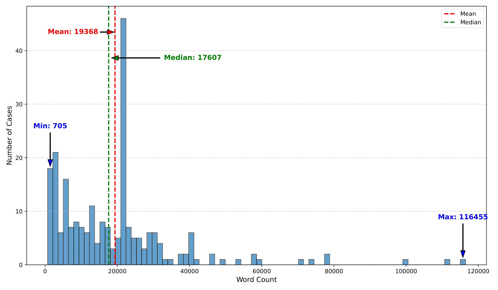

## Do LLMs Truly "Understand" When a Precedent Is Overruled?

[](#python)
[](https://drive.google.com/file/d/1o49Ym_rN7V_tmzfDI2LjzH8xV2BkaQcv/view?usp=sharing)
[](https://drive.google.com/file/d/12z77olfVETEq7B1i_LsakBcPSsdv7PSZ/view?usp=sharing)
[](https://creativecommons.org/licenses/by-nc-sa/4.0/deed.en)

This is the official repository for our paper, **Do LLMs Truly "Understand" When a Precedent Is Overruled?** by Li Zhang, Jaromir Savelka, and Kevin Ashley (University of Pittsburgh & Carnegie Mellon University | JURIX 2025). This research investigates whether Large Language Models (LLMs) can genuinely understand complex legal reasoning tasks, specifically the identification of overruling relationships in U.S. Supreme Court cases.

This repository contains the dataset of 236 U.S. Supreme Court case pairs and provides code to reproduce the experimental results discussed in our paper.

### About the Research

This study addresses a gap in evaluating LLM capabilities for realistic, long-context legal reasoning. In common-law systems, **overruling relationships** are foundational to legal doctrine and are commonly found in judicial opinions. An overruling occurs when a later court declares that a prior decision should no longer be followed as binding precedent.

The research significance includes:

- **Bridging an Evaluation Gap**: Introducing a benchmark that addresses the critical gap in realistic, long-context evaluation for legal reasoning
- **Deep Capability Analysis**: Going beyond accuracy scores to uncover deep-seated limitations of state-of-the-art LLMs when handling authentic legal tasks
- **Enhancing Trustworthy AI**: Providing rigorous empirical evidence and critical insights for deploying LLMs in high-stakes domains like law

### Dataset

The team created a new dataset of **236 U.S. Supreme Court case pairs** from 1789 to 2025. Each pair consists of a case that was explicitly overruled and the subsequent decision(s) that overruled it.

**Key Features:**

- **Source**: Based on a resource maintained by the Constitution Annotated and compiled by searching the Lexis database for all Supreme Court decisions containing the word "overrule"
- **Inclusion Criteria**: A decision is included only when a majority of the Supreme Court has explicitly stated that a prior case is being overruled, avoiding ambiguity by excluding cases that are merely distinguished, limited, or discredited
- **Content**: Full opinion texts for the 236 overruling cases retrieved from CourtListener, including majority, concurring, and dissenting opinions
- **Length Distribution**: Cases range from 705 to 116,455 words, with a median of 17,607 words and mean of 19,368 words

<div style="text-align: center;">
  
  <br><br>
  <strong>Figure 1: Word Count Distribution of 236 Overruling Cases</strong>
  <br>
  This figure shows the distribution of case lengths, with the shortest case having 705 words and the longest having 116,455 words. The median length is 17,727 words, and the mean is 19,368 words, indicating that most cases are substantially long, posing a significant challenge to the long-context capabilities of LLMs.
</div>

### Experimental Tasks

Three tasks of varying difficulty were designed to probe different aspects of model performance:

#### Task 1: Open-Ended Identification

- **Objective**: Simulate a realistic legal research query, testing the model's ability to locate and extract the overruled case(s) from the full text of the overruling case
- **Prompt Template**: "Which case(s) was overruled by [the overruling case]? Here is the related context [case text of the overruling case]."
- **Evaluation**: GPT-4o was used as an automated judge with 98% consistency with human expert assessments

#### Task 2: Closed-Ended Verification

- **Objective**: Reduce the problem to verification, testing if the model can confirm a specific legal relationship when presented with all necessary context
- **Prompt Template**: "Did [the overruling case] overrule [the overruled case]? Here is the related context [case text of the overruling case]."
- **Expected Output**: "true," "false," or "unknown" (correct answer is always "true")

#### Task 3: Reversed Closed-Ended Verification

- **Objective**: Control task to test for fundamental understanding of temporal logic—an earlier case cannot overrule a later one
- **Prompt Template**: "Did [the overruled case] overrule [the overruling case]? Here is the related context [case text of the overruling case]."
- **Expected Output**: "true," "false," or "unknown" (correct answer is always "false")

### Models Evaluated

Five state-of-the-art LLMs known for strong long-context performance were evaluated:

- **Qwen3-235B-A22B-Thinking-2507 (Qwen3)** - Context Length: 262,144
- **Gemini-2.5-flash-lite-preview-06-17 (Gemini-Flash-Lite)** - Context Length: 1,000,000
- **Gemini-2.5-flash-preview-05-20 (Gemini-Flash)** - Context Length: 1,000,000
- **Gemini-2.5-pro-preview-06-05 (Gemini-Pro)** - Context Length: 1,000,000
- **GPT-5-2025-08-07 (GPT-5)** - Context Length: 128,000

**Experimental Setup**: All experiments were conducted with temperature 0.1 and top-p 0.5, with structured JSON output format. GPT-5 was run with default parameters.

### Key Findings

The empirical results revealed three fundamental limitations of current LLMs:

#### Finding 1: Era Sensitivity

All models exhibited significant degradation in performance when dealing with historical cases, revealing a strong temporal bias:

- In the earliest period (1810-1881), Qwen3 and Gemini-Flash-Lite achieved 0% accuracy
- Even the best model in this period, Gemini-Pro, only reached 64.71%
- This suggests models trained primarily on modern texts lack linguistic and conceptual frameworks to parse 19th-century judicial opinions

#### Finding 2: Shallow Reasoning

The stark performance contrast across tasks indicates that models rely on shallow logical heuristics rather than deep legal comprehension:

- In Task 2 (Verification), most models were hesitant, frequently responding "unknown"
- In sharp contrast, for Task 3 (Reversed Verification), models performed exceptionally well, with GPT-5 and Gemini-Pro achieving 100% accuracy
- The high performance in Task 3 is achieved through basic chronological awareness, not genuine comprehension of legal arguments

#### Finding 3: Context-Dependent Reasoning Failures

Models' basic reasoning abilities are inconsistent and fail when the task context becomes more complex and open-ended:

- While models showed perfect temporal logic in simple, closed-ended Task 3, they produced temporally impossible outputs in complex, open-ended Task 1
- The challenge is not a fundamental lack of logical capability, but an inability to integrate that capability with deep legal understanding under high cognitive load

### Sample Data

We provide the dataset in the format as shown below:

```json
{
  "case_name": "Loper Bright Enterprises v. Raimondo, No. 22-451 (U.S. June 28, 2024)",
  "citation": "603 U.S. 369",
  "cleaned_text_opinion": "[Full text of the overruling case...]"
}
```

Since part of the purpose of this dataset is to act as an evaluation benchmark, we want to mitigate the risk of accidentally including this dataset as part of the foundation model training corpora. Thus, to reduce these data contamination risks, we encrypt the dataset in `JURIX2025_paper.zip`.

Unzip it with:

```bash
unzip JURIX2025_paper.zip
# then enter password jurix2025_paper
```

### Citation Information

If you use this dataset or reference this work, please cite it as follows:

```bibtex
@inproceedings{zhang-etal-2025-llm-overruling,
    title = "Do LLMs Truly ``Understand'' When a Precedent Is Overruled?",
    author = "Zhang, Li and Savelka, Jaromir and Ashley, Kevin",
    booktitle = "JURIX 2025",
    year = "2025",
    publisher = "IOS Press"
}
```

### License

This work is licensed under a Creative Commons Attribution-NonCommercial-ShareAlike 4.0 International License.
